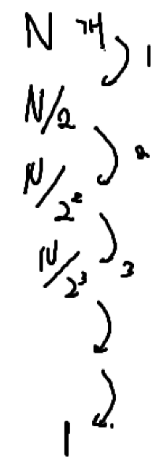
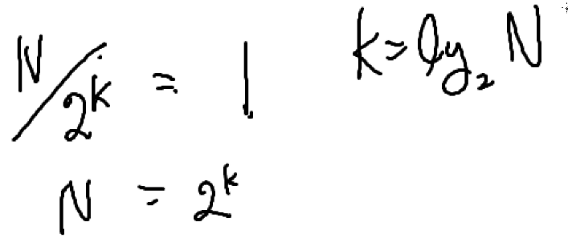

# 이분 탐색 (Binary Search)

2개로 나눠져서 탐색하는 방법  
배열 내에 특정 target을 빠르게 찾는 알고리즘

## 시간복잡도

1. for 문을 활용하여 탐색
   - O(N)
2. 이분탐색
   - O(logN)

이분탐색을 하려면 정렬이 필요함  
하지만 정렬을 하면 추가적으로 O(NlogN)의 시간복잡도를 가진다  
재귀호출로도 구현이 가능하다

## 그럼에도 이분 탐색을 사용하는 이유

여러번 찾아야 할 때 (쿼리가 많을 때)  

ex) 1000개의 정수에서 1000개의 쿼리를 찾는 경우  

1. for 문을 활용하는 경우
   - O(N^2)
2. binary Search를 활용하는 경우
   - O(Nlog(2)N) ??

# 매개변수 탐색 (Parametic Search)

Binary Search의 응용  
lower bound / upper bound (마지노선)를 찾는 알고리즘